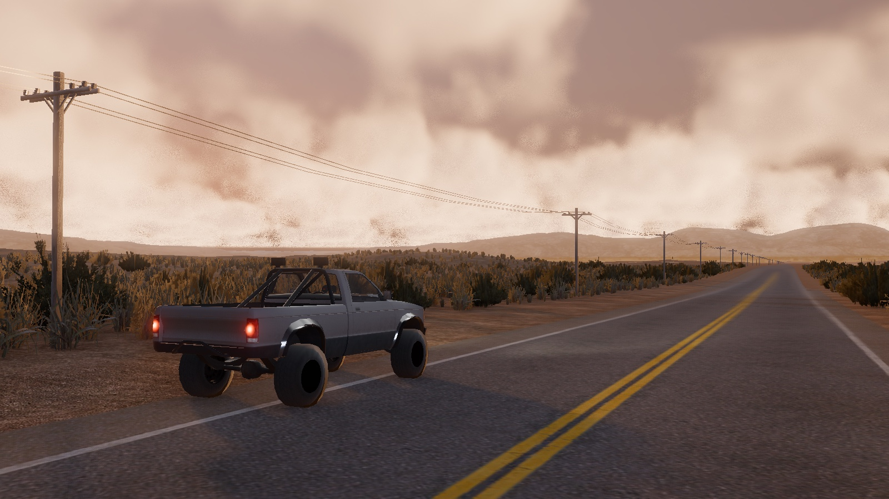

# ror-godot

**An alternative Rigs of Rods client on Godot 4.** Rigs of Rods' own soft-body vehicle
simulation — the node-and-beam solver, unchanged in its laws — wrapped as a GDExtension and
driven through Godot's renderer, terrain, sky and UI. Community vehicles and maps from the Rigs
of Rods repository load from their original files.

## What it does today

- **Loads Rigs of Rods content as it is.** `.truck`, `.car`, `.load` and the rest of the actor
  formats; `.terrn2` terrains with their heightmaps, objects, procedural roads, forests, water and
  grass; Ogre `.mesh` and `.material` through readers of this project's own. 69 library vehicles
  and 734 actors from the public archive load.
- **Drives like Rigs of Rods.** The solver is upstream's: symplectic Euler at 2 kHz, beams that
  deform and break, shocks, hydros, slide nodes, the drivetrain and the contact law. Checked
  against upstream's source function by function, and against its own determinism to the bit.
  It runs on its own thread.
- **Looks like today.** Physically based materials from the legacy ones, physical light units,
  a physical camera, HDR skies calibrated against published daylight, marched clouds, haze and
  fog by Koschmieder's law, a sea that reflects the sky by Fresnel.
- **Plays.** A main menu, a vehicle and a map and a weather to pick, a loading screen, a settings
  panel for every number a weather states, graphics options measured against what they cost.

## Download

[Releases](https://github.com/htdguide/ror-godot/releases) carry a Windows x86_64 zip and a macOS universal `.app`. Nothing is
bundled: vehicles go in `mods/`, maps in `maps/`, beside the executable, one unpacked folder per
pack. The game lists what it finds. Rigs of Rods content is fetched from the
[Rigs of Rods repository](https://forum.rigsofrods.org/resources/) and keeps its own licences.

## How it is built

Every claim is a gate: a script that measures one thing against an outside oracle — upstream's
source, a published constant, a physical law, the file an author wrote — and fails when it
moves. 160 of them, run before every commit, in one window:

    tools/gate.sh --all             the suite
    tools/gate.sh --all --every     every gate, implied ones included
    tools/gate.sh --order-check     every gate twice, shuffled, for order independence
    tools/play.sh                   the game, from the main menu
    tools/play.sh --truck --map lapaz   the hero truck on a map, straight in

Pixels are measured, never approved: the sky against daylight figures, the colour chart in
CIELAB, a white furnace, frame times feature by feature. What a gate cannot judge — whether it
looks right, whether it drives right — a person does, in a window, and what they find becomes
a gate or a named item. See [docs/guides/human-sessions.md](docs/guides/human-sessions.md).

## Building from source

- Godot 4.7.2, with its export templates for releases.
- A C++ toolchain for the extension: clang, scons, Python; `cd extension && scons target=template_debug`.
- Terrain3D, built from the pinned submodule: `tools/build_terrain3d.sh`.
- macOS on Apple Silicon is the development platform; the Windows build is cross-compiled with
  `brew install mingw-w64` and tested on a Windows machine.

Two checkouts: **dev** (this one, with the harness fixtures and the submodule's test map) and
**prod** (`tools/prod.sh setup`, bundling nothing, fed only by `tools/prod.sh merge`).
`tools/release.sh windows|macos` exports from prod.

## Layout

    extension/     the GDExtension: Rigs of Rods' solver, decoupled from OGRE
    game/          the Godot project: readers, builders, shaders, config
    harness/       the gates, the window, the menus — the game's own code lives here too
    tools/         the command line: gates, play, releases, content fetching
    docs/          plan, handoff, decisions, guides; see docs/README.md
    vendor/        pinned submodules: Rigs of Rods, godot-cpp, Terrain3D
    LICENSES/      one record per third-party asset or addon; THIRD_PARTY.md lists them

Where to pick up: [docs/HANDOFF.md](docs/HANDOFF.md). The plan: [docs/PLAN.md](docs/PLAN.md).

## Licence

[GPL-3.0-or-later](LICENSE). This project links Rigs of Rods, which is GPL-3.0-or-later, and
every dependency is GPL-3.0-compatible. Community content is not part of this repository.
